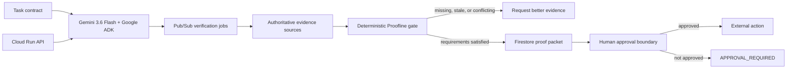

# Architecture

The language model decomposes and explains work, but it cannot override the
deterministic gate. Every packet is addressed by a SHA-256 digest over its
canonical inputs. External actions remain blocked until explicit human approval
is present in the evaluated packet.

## Trust boundaries

- Evidence is useful only when it is fresh, authoritative, and tied to a named
  requirement.
- Conflicting fresh authoritative evidence produces `CONFLICT`, never `READY`.
- Cloud credentials and customer data are not stored in the repository.
- Pub/Sub workers may collect evidence, but only the deterministic core decides
  whether a task satisfies its acceptance contract.
